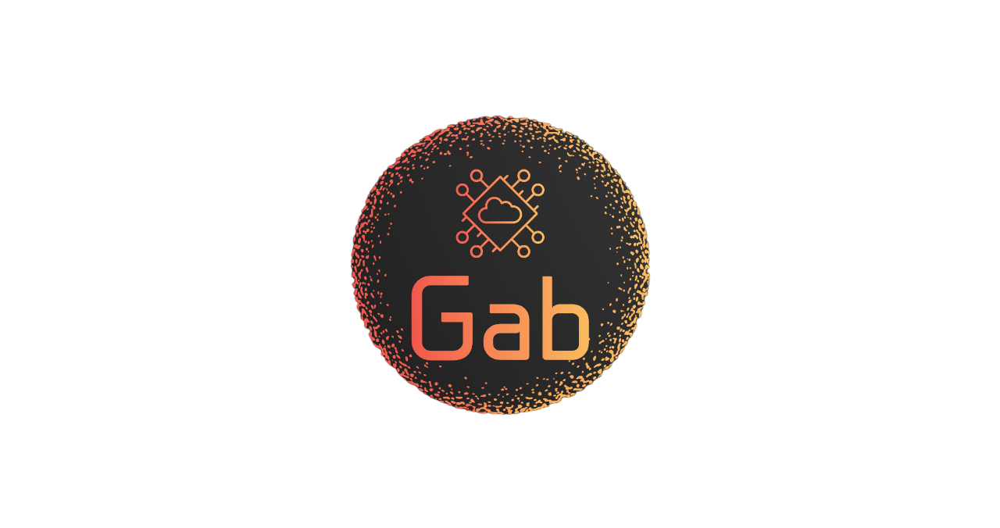

  <h1>&lt; Hello/&gt;! 👋</h1>

  

    <h2 style="font-size:40px;">Gab is here..</h2>
    
    <h4>
      Software developer at 42 Abu Dhabi. Pursuing a BSc in Computer Science at the University of the People with a background in Agricultural Engineering. 
      Passionate about AI and Data Science, holding certifications in Python, Linux, and Machine Learning. 
      With hands-on experience in Python development, data analysis, and data science. 
      Awarded first place twice for machine learning & AI projects.
    </h4>
  

  <h2>My Skills</h2>
  

🔭 I’m currently working on C/C++ projects, and Blockchain projects.

🌱 I’m currently learning Azure, C/C++, python, Ruby, BlockChain tec. 

👯 I’m looking to collaborate on Projects,Tech Articles 

💬 Talk to me about Python, C/C++, Freelancing Opportunities, Open Source 

  
  
    
  
  
  
  
  

<h2> Connect with me  </h2>
 
  

 

